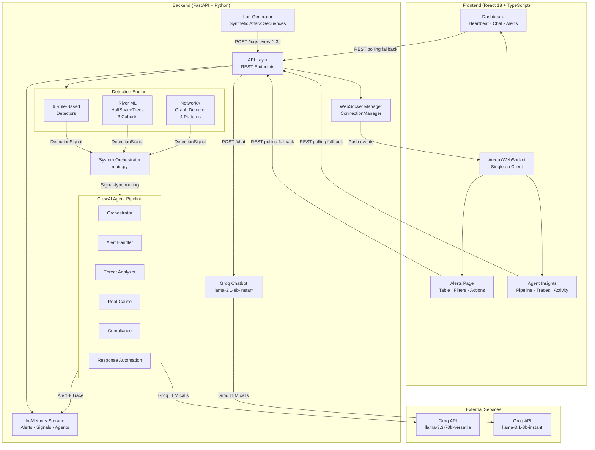

# Arceux — System Architecture

---

## Component Descriptions

**Log Generator** (`server/log_generator.py`) — generates a continuous stream of synthetic security events (successful logins, failed logins, privilege escalations, data downloads, new-country logins) at 1–3 second intervals, and injects structured attack sequences at configurable probabilities to ensure all detection paths exercise reliably. It waits for the server health check before sending any events and enforces a 30-second warmup guard before graph attack sequences begin, giving River ML time to build a baseline.

**API Layer** (`server/api.py`) — the FastAPI application that exposes all REST endpoints and the `/ws` WebSocket endpoint. It handles log ingestion by calling the detection engine synchronously on every `POST /logs`, then stores any resulting signal for background processing. It also owns the `compute_compliance_status()` pure function that derives live IRDAI, GDPR, SOC 2, ISO 27001, and PCI DSS posture from unresolved alert data.

**Detection Engine** (`server/detection_engine.py`) — a stateful class that runs three detection layers on every log in order. The six rule-based detectors (Brute Force, Suspicious Login, Impossible Travel, Account Takeover, Insider Threat, Data Exfiltration) use sliding-window deques and fire first. If no rule fires, the River ML detector scores the event against a per-cohort HalfSpaceTrees model. If River also produces nothing, the NetworkX graph detector checks structural patterns on the current rolling graph.

**System Orchestrator** (`server/main.py`) — the unified entry point that starts the Uvicorn API server and the log generator as daemon threads, then runs a `process_pending_signals()` background coroutine inside the FastAPI event loop. The coroutine enforces a 15-second pipeline cooldown, picks the most recent pending signal, and dispatches it to the CrewAI pipeline via `run_in_threadpool`.

**WebSocket Manager** (`server/websocket_manager.py`) — tracks all active WebSocket connections in a list protected by an asyncio lock. The `broadcast()` coroutine fans a message to all connections concurrently via `asyncio.gather`, automatically pruning dead connections on failure. The `broadcast_sync()` function allows the crew system (running in a thread-pool) to schedule broadcasts onto the main event loop via `asyncio.run_coroutine_threadsafe`.

**CrewAI Agent Pipeline** (`server/agents/crew_system.py`) — implements the six-agent investigation pipeline with signal-type routing. The `get_agents_for_signal()` function maps each signal type to a subset of agents (3–6), so a Brute Force signal runs only Alert Handler, Threat Analyzer, and Response Automation while an Insider Threat signal runs all six. Each agent uses a dedicated Groq API key from its own account for rate-limit isolation, with fallback to the shared `GROQ_API_KEY`. After every pipeline run, agent states and a `pipeline_completed` event are broadcast to all WebSocket clients.

**Groq Chatbot** (`server/chatbot.py`) — an AI analyst assistant powered by `llama-3.1-8b-instant` that injects live system state (recent alerts sorted by severity, agent pipeline status, severity counts) into every Groq call. It supports multi-turn conversation via a `conversation_history` parameter and four quick-action prompts (explain last alert, threat summary, recommended actions, system status). When Groq is unavailable, it falls back to data-driven text responses built from real storage data rather than generic templates.

**In-Memory Storage** (`server/storage.py`) — a thread-safe class that holds all runtime data: logs (capped at 1000), detection signals, alerts, executed actions, per-agent state dictionaries, and pipeline rate-limit fields. All reads and writes are protected by a `threading.Lock`. There is no disk persistence — the storage always starts clean on every server restart.

**ArceuxWebSocket** (`client/src/services/websocket.ts`) — a singleton WebSocket client that maintains a single persistent connection to `/ws`, reconnects with exponential backoff (2 s → 30 s max), sends keepalive `ping` frames every 25 seconds, and exposes a typed `on(eventType, callback)` subscription API used by the `useWebSocket` React hook. It also stores the chatbot conversation history so messages persist across page navigation.

**Dashboard** (`client/src/pages/Dashboard.tsx`) — the main analyst view showing a live SVG system heartbeat for six components, the AI analyst chat panel with conversation persistence, a high-priority alert feed receiving `new_alert` WebSocket pushes, a Recharts severity bar chart updated by `metrics_updated` pushes, a dynamic system performance card, and a compliance status panel with IRDAI live countdown.

**Alerts Page** (`client/src/pages/Alerts.tsx`) — the alert management view with a searchable, filterable table, a slide-out detail panel showing the full AI agent trace and recommended actions, Take Ownership and Execute Action controls with optimistic UI updates, Run Playbook triggering, and CSV export.

**Agent Insights** (`client/src/pages/AgentInsights.tsx`) — the pipeline monitoring view showing six agent cards with live status indicators, execution traces, and task statistics. A full-width activity feed bar at the top derives its state from `agent_status_updated` and `pipeline_completed` WebSocket events with zero additional API calls. All components are wrapped in `React.memo` with structural comparator state updates to prevent visual artifacts during rapid polling.
